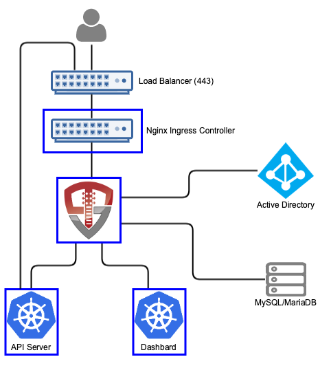

# Kubernetes Identity Manager

[](https://vimeo.com/246464075)

*Short video of logging into Kubernetes and using kubectl using ADFS*

This quick start for OpenUnison is designed to provide an identity management hub for Kubernetes that will:

1. Support authentication with Active Directory for both `kubectl` and the dashboard (https://github.com/kubernetes/dashboard)
2. Automated creation of Namespaces
2. Self service portal for requesting access to and getting approval for individual namespaces
3. Self service requests for gaining cluster level roles
4. Support removing users' access
5. Reporting

The quick start is designed to run inside of Kubernetes, leveraging Kubernetes for scalability and secret management and deployment. 



When a user accesses Kubernetes using OpenUnison, they'll access both te self service portal and the dashboard through OpenUnison (instead of directly via an ingress).  OpenUnison will inject the user's identity into each request, allowing the dashboard to act on their behalf.

The OpenUnison deployment stores all Kubernetes access information as a groups inside of a relational database, as opposed to a group in an external directory.  OpenUnison will create the approprioate Roles and RoleBindings to allow for the access.

# Roles Supported

## Cluster

1.  Administration - Full cluster management access

## Namespace

1.  Administrators - All operations inside of a namespace
2.  Viewers - Can view contents of a namespace, but can not make changes

## Non-Kubernetes

1.  System Approver - Able to approve access to roles specific to OpenUnison
2.  Auditor - Able to view audit reports, but not request projects or approve access

# Deployment

## What You Need To Start

Prior to deploying OpenUnison you will need:

1. Kubernetes 1.10 or higher
2. The Nginx Ingress Controler deployed (https://kubernetes.github.io/ingress-nginx/deploy/)
3. A MySQL or MariaDB Database
4. The certificate authority certificate for your Active Directory forest
5. An SMTP server for sending notifications

## Create Environments File

OpenUnison stores environment specific information, such as host names, passwords, etc, in a properties file that will then be loaded by OpenUnison and merged with its configruation.  This file will be stored in Kubernetes as a secret then accessed by OpenUnison on startup to fill in the `#[]` parameters in `unison.xml` and `myvd.conf`.  For instance the parameter `#[OU_HOST]` in `unison.xml` would have an entry in this file.  Below is an example file:

```properties
OU_HOST=k8sou.tremolo.lan
K8S_DASHBOARD_HOST=k8sdb.tremolo.lan
K8S_URL=https://k8s-installer-master.tremolo.lan:6443
OU_COOKIE_DOMAIN=tremolo.lan
OU_HIBERNATE_DIALECT=org.hibernate.dialect.MySQL5InnoDBDialect
OU_QUARTZ_DIALECT=org.quartz.impl.jdbcjobstore.StdJDBCDelegate
OU_JDBC_DRIVER=com.mysql.jdbc.Driver
OU_JDBC_URL=jdbc:mysql://dbs.tremolo.lan:3308/unison
OU_JDBC_USER=root
OU_JDBC_PASSWORD=start123
OU_JDBC_VALIDATION=SELECT 1
SMTP_HOST=smtp.gmail.com
SMTP_PORT=587
SMTP_USER=donotreply@domain.com
SMTP_PASSWORD=xxxx
SMTP_FROM=donotreply@domain.com
SMTP_TLS=true
AD_BASE_DN=cn=users,dc=ent2k12,dc=domain,dc=com
AD_HOST=192.168.2.75
AD_PORT=636
AD_BIND_DN=cn=Administrator,cn=users,dc=ent2k12,dc=domain,dc=com
AD_BIND_PASSWORD=password
AD_CON_TYPE=ldaps
SRV_DNS=false
OU_CERT_OU=k8s
OU_CERT_O=Tremolo Security
OU_CERT_L=Alexandria
OU_CERT_ST=Virginia
OU_CERT_C=US
unisonKeystorePassword=start123
USE_K8S_CM=true
SESSION_INACTIVITY_TIMEOUT_SECONDS=900
MYVD_CONFIG_PATH=WEB-INF/myvd.conf
```

*Detailed Description or Properties*

| Property | Description |
| -------- | ----------- |
| OU_HOST  | The host name for OpenUnison.  This is what user's will put into their browser to login to Kubernetes |
| K8S_DASHBOARD_HOST | The host name for the dashboard.  This is what users will put into the browser to access to the dashboard. **NOTE:** `OU_HOST` and `K8S_DASHBOARD_HOST` **MUST** share the same DNS suffix. Both `OU_HOST` and `K8S_DASHBOARD_HOST` **MUST** point to OpenUnison |
| K8S_URL | The URL for the Kubernetes API server |
| OU_COOKIE_DOMAIN | The DNS Domain for cookies generated by OpenUnison.  This domain **MUST** contain both `OU_HOST` and `K8S_DASHBOARD_HOST` |
| OU_HIBERNATE_DIALECT | Hibernate dialect for accessing the database.  Unless customizing for a different database do not change |
| OU_QUARTZ_DIALECT | Dialect used by the Quartz Scheduler.  Unless customizing for a different database do not change  |
| OU_JDBC_DRIVER | JDBC driver for accessing the database.  Unless customizing for a different database do not change |
| OU_JDBC_URL | The URL for accessing the database |
| OU_JDBC_USER | The user for accessing the database |
| OU_JDBC_PASSWORD | The password for accessing the database |
| OU_JDBC_VALIDATION | A query for validating database connections/ Unless customizing for a different database do not change |
| SMTP_HOST | Host for an email server to send notifications |
| SMTP_PORT | Port for an email server to send notifications |
| SMTP_USER | Username for accessing the SMTP server (may be blank) |
| SMTP_PASSWORD | Password for accessing the SMTP server (may be blank) |
| SMTP_FROM | The email address that messages from OpenUnison are addressed from |
| SMTP_TLS | true or false, depending if SMTP should use start tls |
| AD_BASE_DN | The search base for Active Directory |
| AD_HOST | The host name for a domain controller or VIP.  If using SRV records to determine hosts, this should be the fully qualified domain name of the domain |
| AD_PORT | The port to communicate with Active Directory |
| AD_BIND_DN | The full distinguished name (DN) of a read-only service account for working with Active Directory |
| AD_BIND_PASSWORD | The password for the `AD_BIND_DN` |
| AD_CON_TYPE | `ldaps` for secure, `ldap` for plain text |
| SRV_DNS | If `true`, OpenUnison will lookup domain controllers by the domain's SRV DNS record |
| OU_CERT_OU | The `OU` attribute for the forward facing certificate |
| OU_CERT_O | The `O` attribute for the forward facing certificate |
| OU_CERT_L | The `L` attribute for the forward facing certificate |
| OU_CERT_ST | The `ST` attribute for the forward facing certificate |
| OU_CERT_C | The `C` attribute for the forward facing certificate |
| unisonKeystorePassword | The password for OpenUnison's keystore |
| USE_K8S_CM | Tells the deployment system if you should use k8s' built in certificate manager.  If your distrobution doesn't support this (such as Canonical and Rancher), set this to false |
| SESSION_INACTIVITY_TIMEOUT_SECONDS | The number of seconds of inactivity before the session is terminated, also the length of the refresh token's session |
| MYVD_CONFIG_PATH | The path to the MyVD configuration file, unless being customized, use `WEB-INF/myvd.conf` |

## Prepare Deployment

Perform these steps from a location with a working `kubectl` configuration:

1. Create a directory to store `input.props`, ie `/path/to/props` and put `input.props` in that directory
2. Create a directory for the Active Directory root certificate and store it there with the name `trusted-adldaps.pem`, ie `/path/to/certs`

## Deployment

Based on where you put the files from `Prepare Deployment`, run the following:

```
curl https://raw.githubusercontent.com/TremoloSecurity/kubernetes-artifact-deployment/master/src/main/bash/deploy_openunison.sh | bash -s /path/to/certs /path/to/props https://raw.githubusercontent.com/TremoloSecurity/openunison-qs-kubernetes/activedirectory/src/main/yaml/artifact-deployment.yaml
```

The output will look like:

```
namespace/openunison-deploy created
configmap/extracerts created
secret/input created
clusterrolebinding.rbac.authorization.k8s.io/artifact-deployment created
job.batch/artifact-deployment created
NAME                        READY     STATUS    RESTARTS   AGE
artifact-deployment-jzmnr   0/1       Pending   0          0s
artifact-deployment-jzmnr   0/1       Pending   0         0s
artifact-deployment-jzmnr   0/1       ContainerCreating   0         0s
artifact-deployment-jzmnr   1/1       Running   0         4s
artifact-deployment-jzmnr   0/1       Completed   0         15s
```

Once you see `Completed`, you can exit the script (`Ctl+C`).  This script creates all of the appropriate objects in Kubernetes, signs certificates and deploys both OpenUnison and the Dashboard.  

## Complete SSO Integration with Kubernetes

Run `kubectl describe configmap api-server-config -n openunison` to get the SSO integration artifacts.  The output will give you both the certificate that needs to be trusted and the API server flags that need to be configured on your API servers.

## First Login to the Kubernetes Identity Manager

At this point you should be able to login to OpenUnison using the host specified in  the `OU_HOST` of your properties.  Once you are logged in, logout.  Users are created in the database "just-in-time", meaning that once you login the data representing your user is created inside of the database deployed for OpenUnison.

## Create First Administrator

The user you logged in as is currently unprivileged.  In order for other users to login and begin requesting access to projects this first user must be enabled as an approver.  Login to the MySQL database deployed for OpenUnison and execute the following SQL:

```sql
insert into userGroups (userId,groupId) values (2,1);
```

This will add the administrator group to your user.  Logout of OpenUnison and log back in.

## Self Request & Approve Cluster Administrator

Once SSO is enabled in the next step, you'll need a cluster administrator to be able to perform cluster level operations:

1.  Login to OpenUnison
2.  Click on "Request Access" in the title bar
3.  Click on "Kubernetes Administration"
4.  Click "Add To Cart" next to "Cluster Administrator"
5.  Next to "Check Out" in the title bar you'll see a red `1`, click on "Check Out"
6.  For "Supply Reason", give a reason like "Initial user" and click "Submit Request"
7.  Since you are the only approver refresh OpenUnison, you will see a red `1` next to "Open Approvals".  Click on "Open Approvals"
8. Click "Review" next to your email address
9. Specify "Initial user" for the "Justification" and click "Approve"
10. Click on "Confirm Approval"

At this point you will be provisioned to the `k8s-cluster-administrators` group in the database that has a RoleBinding to the `cluster-admin` Role.  Logout of OpenUnison and log back in.  If you click on your email address in the upper left, you'll see that you have the Role `k8s-cluster-administrators`.  

# Updating Secrets and Certificates

In order to change the secrets or update certificate store:

Download the contents of `openunison-secrets` in the `openunison` namespace into an empty directory

```
kubectl get  secret openunison-secrets -o json  -n openunison | python /apth/to/openunison-qs-kubernetes/src/main/python/download_secrets.py
```

`download_secrets.py` is a utility script for pulling the files out of secrets and config maps.  Next, make your changes.  You can't apply over an existing secret, so next delete the current secret:

```
kubectl delete secret openunison-secrets -n openunison
```

Finally, create the secret from the directory where you downloaded the secrets:

```
kubectl create secret generic openunison-secrets --from-file=. -n openunison
```

Redpeloy OpenUnison to pick up the changes.  The easiest way is to update an environment variable in the `openunison` deployment

# Whats next?
Users can now login to create namespaces, request access to cluster admin or request access to other clusters.

Now you can begin mapping OpenUnison's capabilities to your business and compliance needs.  For instance you can add multi-factor authentication with TOTP or U2F, Create privileged workflows for onboarding, scheduled workflows that will deprovision users, etc.

# Customizing Directory Connections

If you're running multiple directories, or need to connect to a generic LDAP directory isntead of Active Directory you can provide a custom MyVirtualDirectory configuration file without a re-build of your containers.  Start with the myvd.conf file at https://github.com/OpenUnison/openunison-k8s-login-activedirectory/blob/master/src/main/webapp/WEB-INF/myvd.conf.  ONLY edit the section that begins with `server.activedirectory`.  As an example, the below configuration works against a generic LDAPv3 directory with the `VirtualMemberOf` insert configured to create a `memeberOf` attribute on users so we can supply groups to Kubernetes:

```
#Global AuthMechConfig
server.globalChain=accesslog

server.globalChain.accesslog.className=com.tremolosecurity.proxy.myvd.log.AccessLog

server.nameSpaces=rootdse,myvdroot,shadowUsers,activedirectory
server.rootdse.chain=dse
server.rootdse.nameSpace=
server.rootdse.weight=0
server.rootdse.dse.className=net.sourceforge.myvd.inserts.RootDSE
server.rootdse.dse.config.namingContexts=o=Tremolo
server.myvdroot.chain=root
server.myvdroot.nameSpace=o=Tremolo
server.myvdroot.weight=0
server.myvdroot.root.className=net.sourceforge.myvd.inserts.RootObject

server.shadowUsers.chain=debug,mapping,api
server.shadowUsers.nameSpace=ou=shadow,o=Tremolo
server.shadowUsers.weight=0
server.shadowUsers.enabled=true
server.shadowUsers.debug.className=net.sourceforge.myvd.inserts.DumpTransaction
server.shadowUsers.debug.config.logLevel=info
server.shadowUsers.debug.config.label=k8s
server.shadowUsers.mapping.className=net.sourceforge.myvd.inserts.mapping.AttributeMapper
server.shadowUsers.mapping.config.mapping=mail=email,givenName=first_name,sn=last_name
server.shadowUsers.api.className=com.tremolosecurity.myvd.K8sCrdInsert
server.shadowUsers.api.config.nameSpace=openunison
server.shadowUsers.api.config.k8sTargetName=k8s

server.activedirectory.chain=objectguid2text,dnmapper,memberof,objmap,membertrans,ldap
server.activedirectory.nameSpace=ou=activedirectory,o=Data
server.activedirectory.weight=0
server.activedirectory.enabled=true
server.activedirectory.objectguid2text.className=com.tremolosecurity.proxy.myvd.inserts.util.UUIDtoText
server.activedirectory.objectguid2text.config.attributeName=objectGUID
server.activedirectory.dnmapper.className=net.sourceforge.myvd.inserts.mapping.DNAttributeMapper
server.activedirectory.dnmapper.config.dnAttribs=member,owner,member,distinguishedName,manager
server.activedirectory.dnmapper.config.localBase=ou=activedirectory,o=Data
server.activedirectory.dnmapper.config.urlAttribs=
server.activedirectory.dnmapper.config.remoteBase=#[AD_BASE_DN]
server.activedirectory.memberof.className=net.sourceforge.myvd.inserts.mapping.VirtualMemberOf
server.activedirectory.memberof.config.searchBase=ou=activedirectory,o=Data
server.activedirectory.memberof.config.applyToObjectClass=inetOrgPerson
server.activedirectory.memberof.config.attributeName=memberOf
server.activedirectory.memberof.config.searchObjectClass=groupOfNames
server.activedirectory.memberof.config.searchAttribute=member
server.activedirectory.memberof.config.replace=false
server.activedirectory.objmap.className=net.sourceforge.myvd.inserts.mapping.AttributeValueMapper
server.activedirectory.objmap.config.mapping=objectClass.inetOrgPerson=inetOrgPerson,objectClass.groupofnames=groupOfNames
server.activedirectory.membertrans.className=net.sourceforge.myvd.inserts.mapping.AttributeMapper
server.activedirectory.membertrans.config.mapping=member=member,uid=uid
server.activedirectory.ldap.className=com.tremolosecurity.proxy.myvd.inserts.ad.ADLdapInsert
server.activedirectory.ldap.config.host=#[AD_HOST]
server.activedirectory.ldap.config.port=#[AD_PORT]
server.activedirectory.ldap.config.remoteBase=#[AD_BASE_DN]
server.activedirectory.ldap.config.proxyDN=#[AD_BIND_DN]
server.activedirectory.ldap.config.proxyPass=#[AD_BIND_PASSWORD]
server.activedirectory.ldap.config.useSrvDNS=#[SRV_DNS]
server.activedirectory.ldap.config.ignoreRefs=true
server.activedirectory.ldap.config.passBindOnly=true
server.activedirectory.ldap.config.maxIdle=90000
server.activedirectory.ldap.config.maxMillis=90000
server.activedirectory.ldap.config.maxStaleTimeMillis=90000
server.activedirectory.ldap.config.minimumConnections=10
server.activedirectory.ldap.config.maximumConnections=10
server.activedirectory.ldap.config.usePaging=false
server.activedirectory.ldap.config.pageSize=0
server.activedirectory.ldap.config.heartbeatIntervalMillis=60000
server.activedirectory.ldap.config.type=#[AD_CON_TYPE]
server.activedirectory.ldap.config.sslSocketFactory=com.tremolosecurity.proxy.ssl.TremoloSSLSocketFactory
```

Once OpenUnison is deployed, create a directory with your `myvd.conf` file in it and deploy it as a `ConfigMap`:

```
kubectl create configmap myvd --from-file . -n openunison
```

Next edit the `openunison` deployment to mount the `ConfigMap` to `/etc/myvd` and change the environment variable `MYVD_CONFIG_PATH` to `/etc/myvd/myvd.conf`.  Once the OpenUnison pods have been recreated, you can login with your LDAP uid (as opposed to an Active Directory samAccountName).

